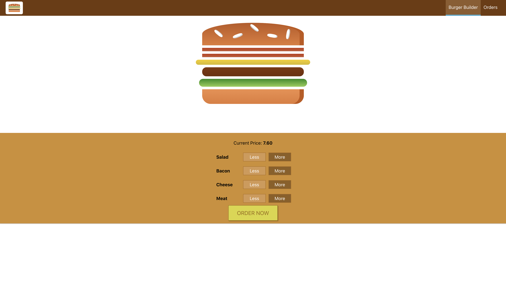

# Project Title
🍔 Burger App

## Table of Content:

- [About The App](#about-the-app)
- [Features](#features)
- [Screenshots](#screenshots)
- [Technologies](#technologies)
- [Setup](#setup)
- [License](#license)

## About The App
This is a burger builder application developed as part of the "React - The Complete Guide (incl. Hooks, React Router, Redux)" Udemy course by Maximilian Schwarzmüller. The app allows users to build custom burgers, view order summaries, and place orders — demonstrating core React concepts and best practices in a real-world project.

## Features
- Build a custom burger by adding/removing ingredients
- View a dynamic price calculation
- Place orders with a checkout form and integration with react context API
- Error handling with custom error boundaries and modals
- Loading spinners and UX enhancements

## Screenshots



## Technologies
The following architectures were use in the development of this project: 
- React Router
- Axios
- Jest
- Next.js

## Setup
1. Download or clone the repository
    ```sh
    git clone https://github.com/ry4ngch/PyCloud.git
    ```
2. Navigate to the folder
    ```sh
    cd burger_app
    ```
3. Install NPM Packages to install necessary dependencies
    ```sh
    npm install
    ```
4. type `npm start` to start the application

## License

Distributed under the MIT License. See LICENSE.txt for more information.