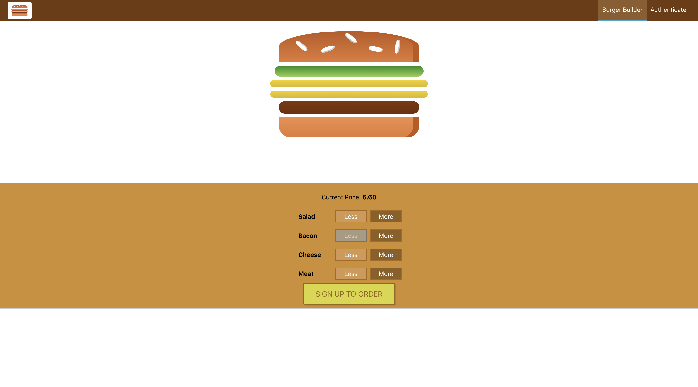

# Burger Builder Application
🍔 Burger Builder App With Redux

## Table of Content:

- [About The App](#about-the-app)
- [Features](#features)
- [Screenshots](#screenshots)
- [Technologies](#technologies)
- [Setup](#setup)
- [License](#license)

## About The App
Burger App Redux is a burger builder application developed as part of the "React - The Complete Guide (incl. Hooks, React Router, Redux)" Udemy course by Maximilian Schwarzmüller. The app allows users to build custom burgers, view order summaries, and place orders — demonstrating core React concepts and best practices in a real-world project. This application is similar to the other burger app in this repository. However, the other burger app does not use redux but the internal build react context API.

This versions also contains the firebase implementation of auth login and orders are store remotely on google's firebase.

> [!NOTE]
> This project is based on the Udemy React course with Maximilian Schwarzmüller.

## Features
- Build a custom burger by adding/removing ingredients
- View a dynamic price calculation
- Place orders with a checkout form
- Store orders in a Firebase backend
- Authentication (Sign Up / Login) with protected routes
- Persistent authentication with auto-login and logout
- Error handling with custom error boundaries and modals
- Loading spinners and UX enhancements

## Screenshots



## Technologies
The following architectures were use in the development of this project: 
- React Router
- Axios
- Redux
- Redux Dev Tools
- Redux Thunk
- Redux Saga
- Jest
- Next.js
- Firebase

## Setup
1. Download or clone the repository
    ```sh
    git clone https://github.com/ry4ngch/PyCloud.git
    ```
2. Navigate to the folder
    ```sh
    cd burger_app_redux
    ```
3. Install NPM Packages to install necessary dependencies
    ```sh
    npm install
    ```
4. type `npm start` to start the application

## License

Distributed under the MIT License. See LICENSE.txt for more information.